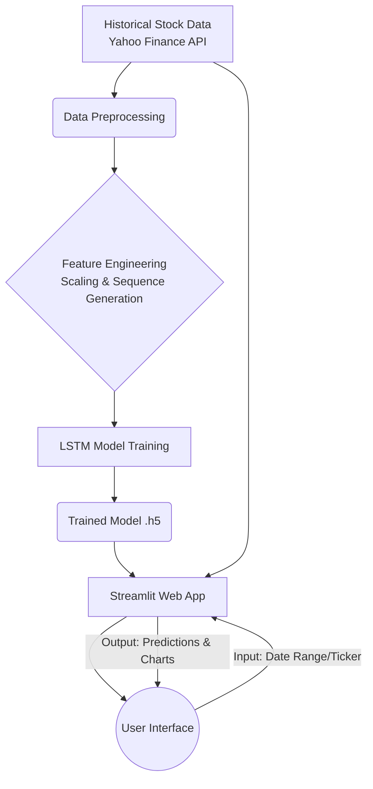

# 📈 TCS Stock Price Prediction App using LSTM


A machine learning web application that predicts the future stock prices of Tata Consultancy Services (TCS) using Long Short-Term Memory (LSTM) neural networks. The app provides an interactive interface to visualize historical data, moving averages, and future price predictions.

## 🏗️ Architecture & Data Flow



## ✨ Features

- **Historical Data Visualization:** View interactive charts of TCS stock prices over time.
- **Moving Averages:** Analyze trends with 100-day and 200-day Moving Averages (MA).
- **LSTM Prediction:** Get highly accurate stock price predictions using a deep learning LSTM model.
- **Interactive UI:** Built with Streamlit for a seamless and responsive user experience.
- **Real-time Data Fetching:** Integrates with `yfinance` to fetch the latest market data.

## 🛠️ Tech Stack

- **Language:** Python
- **Deep Learning Framework:** TensorFlow / Keras
- **Web Framework:** Streamlit
- **Data Manipulation:** Pandas, NumPy
- **Data Visualization:** Matplotlib, Plotly
- **Data Source:** yfinance

## 🚀 Installation & Setup

1. **Clone the repository**
   ```bash
   git clone https://github.com/Rupeshbhardwaj002/TCS_Stock_Price_Prediction_app_using_LSTM.git
   cd TCS_Stock_Price_Prediction_app_using_LSTM
   ```

2. **Create a virtual environment (optional but recommended)**
   ```bash
   python -m venv venv
   source venv/bin/activate  # On Windows use `venv\Scripts\activate`
   ```

3. **Install dependencies**
   ```bash
   pip install -r requirements.txt
   ```

4. **Run the application**
   ```bash
   streamlit run app.py
   ```

## 📊 Usage

1. Open the provided local URL (usually `http://localhost:8501`) in your web browser.
2. The app will automatically load the historical data for TCS.
3. Navigate through the tabs to view raw data, moving averages, and the final LSTM predictions.
4. Compare the original closing prices with the predicted prices on the interactive chart.

## 📁 Project Structure

```text
├── app.py                 # Main Streamlit application script
├── TCS_model.h5           # Pre-trained LSTM model
├── TCS_Stock_Prediction.ipynb # Jupyter notebook with EDA and Model Training
├── requirements.txt       # Python dependencies
└── README.md              # Project documentation
```

## 📈 Results

The LSTM model has been trained on historical TCS stock data and demonstrates a strong capability to capture the underlying trend of the stock's movement. *Note: Stock market predictions are highly volatile and this tool is for educational purposes only.*

## 🤝 Contributing

Contributions, issues, and feature requests are welcome!
Feel free to check [issues page](https://github.com/Rupeshbhardwaj002/TCS_Stock_Price_Prediction_app_using_LSTM/issues).

## 📝 License

This project is [MIT](LICENSE) licensed.
